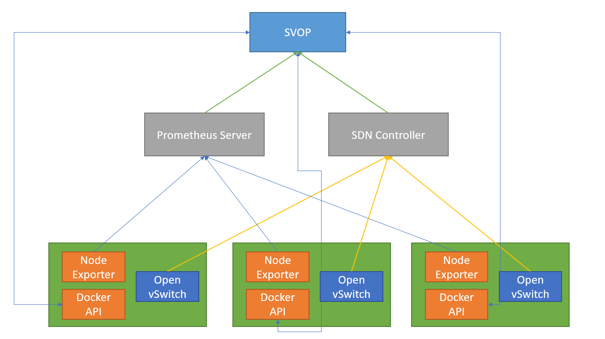

# SVOP
Simple VNF Orchestration Platform 

# Architecture

You can find the architecture in the link below:


## Problems Encountered

1. You should first ping the host on the overlay IP so that the rules are setup using the Ryu controller. Otherwise it won't work and SSH using overlay IP will fail.

2. OpenFlow versioning may cause the port number to not be transported correctly. You should set the OpenFlow version number using this command: ```sudo ovs-vsctl set bridge mybridge protocols=OpenFlow10```

3. Sometimes the learning switch changes the capablities of the switch. For example, changes the config of the OVS switch and disable some of the ports. You should make sure to use a learning switch which doesn't do that.
